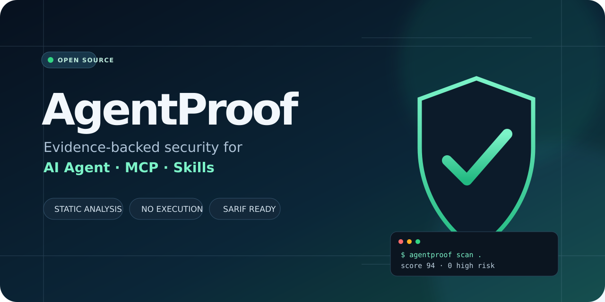
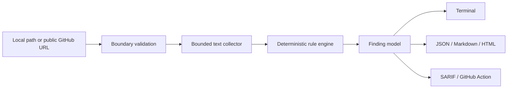

<p align="center">
  
</p>

<p align="center">
  <a href="https://github.com/xie176320/agentproof/actions/workflows/ci.yml"></a>
  <a href="https://agentproof.streamlit.app/"></a>
  <a href="https://github.com/xie176320/agentproof/blob/main/LICENSE"></a>
  <a href="https://www.python.org/"></a>
  <a href="https://github.com/xie176320/agentproof/releases"></a>
</p>

AgentProof is a deterministic static scanner for repositories that contain **AI Agent instructions, MCP servers, or Agent Skills**. It finds risky permissions and supply-chain patterns, attaches line-level evidence, recommends a fix, and exports reports for people and CI systems.

> **Security boundary:** AgentProof reads text. It does not import, build, install, or execute code from the repository being scanned. The public web demo accepts public GitHub repository URLs only and intentionally has no file uploader.

## Why AgentProof

AI-enabled repositories increasingly mix natural-language instructions with executable tool configuration. Conventional linters understand source syntax; they usually do not review instructions such as “run any command,” wildcard MCP approvals, unpinned package runners, or malformed `SKILL.md` metadata. AgentProof adds a small, auditable rules layer for that gap.

- Evidence before scores: every finding includes rule, severity, file, line, evidence and remediation.
- No LLM required: scans are reproducible, offline for local targets, and do not send code to a model.
- GitHub-native: terminal, JSON, Markdown, standalone HTML and SARIF output.
- Safe remote mode: only strict public `github.com/owner/repository` URLs, bounded downloads and guarded extraction.
- Zero CLI dependencies: the scanner itself uses the Python standard library.

## 60-second start

```bash
git clone https://github.com/xie176320/agentproof.git
cd agentproof
python -m pip install -e .

# Scan the current repository
agentproof scan .

# Scan a public GitHub repository without cloning it yourself
agentproof scan https://github.com/owner/repository

# Produce a GitHub code-scanning report
agentproof scan . --format sarif --output agentproof.sarif
```

Example summary:

```text
AgentProof score: 42/100 (F)
Security: 30/100 | Engineering quality: 90/100
Findings: 1 critical, 3 high, 2 medium, 1 low
Scanned 74 text files in 38 ms
```

Try the deliberately unsafe and safe fixtures side by side:

```bash
agentproof scan examples/vulnerable-agent --no-quality --fail-on none
agentproof scan examples/safe-agent --no-quality
```

## What it checks

| Rule | Severity | Check |
|---|---|---|
| AP001 | Critical | Hardcoded credential-like values, with evidence redaction |
| AP002 | High | Remote response piped directly to a shell |
| AP003 | High | Destructive commands and broadly writable permissions |
| AP004 | High | Higher-priority instruction and hidden-prompt overrides |
| AP005 | High | MCP servers launched through general-purpose shells |
| AP006 | High | Wildcard MCP automatic approval |
| AP007 | Medium | Plain HTTP and disabled TLS verification |
| AP008 | Medium | Unpinned package execution in MCP configuration |
| AP009 | Low | Missing `SKILL.md` name or description metadata |
| AP010 | High | Unrestricted agent command, filesystem or confirmation authority |
| AP011 | High | Dynamic execution of external or decoded content |
| AP012–AP015 | Low | Security policy, CI, license and automated-test readiness |
| AP016 | Medium | Symbolic links that escape the repository boundary |

See [the rule reference](docs/rules.md) for scope, rationale, remediation and false-positive guidance.

## CLI

```text
agentproof scan [TARGET]
  --format table|json|markdown|html|sarif
  --output PATH
  --fail-on critical|high|medium|low|none
  --exclude GLOB                 # repeatable
  --disable-rule APxxx           # repeatable
  --config PATH
  --max-file-size BYTES
  --max-files COUNT
  --no-quality
  --no-color

agentproof rules
agentproof --version
```

Project settings can live in `.agentproof.toml`:

```toml
[tool.agentproof]
exclude = ["vendor/**", "docs/generated/**"]
disable_rules = []
max_file_size = 1000000
```

Configuration inside a remotely scanned repository is deliberately ignored so that an untrusted target cannot disable its own checks.

## GitHub Action

```yaml
name: AgentProof
on:
  pull_request:
  push:
    branches: [main]

permissions:
  contents: read

jobs:
  scan:
    runs-on: ubuntu-latest
    steps:
      - uses: actions/checkout@v4
      - uses: xie176320/agentproof@v0.1.0
        with:
          path: .
          fail-on: high
          format: sarif
          output: agentproof.sarif
```

Organizations with GitHub code scanning enabled can upload `agentproof.sarif` with `github/codeql-action/upload-sarif` and `security-events: write` permission.

## Architecture



The project separates retrieval, traversal, rules, findings and reporting. Adding a reporter cannot expand scanner permissions, and remote retrieval never executes repository content. Read the [architecture](docs/architecture.md) and [threat model](docs/threat-model.md).

## Public demo

**[Open the public AgentProof demo](https://agentproof.streamlit.app/).** Paste a public GitHub repository URL to scan it without uploading files or executing repository code.

The Streamlit application is in [`web/app.py`](web/app.py). It exposes URL-only scanning and four report downloads. Deployment and verification details are in [docs/demo.md](docs/demo.md).

## Scope and limitations

AgentProof is an early static-analysis tool, not a sandbox and not a guarantee of safety.

- It can miss obfuscated, generated, semantic or runtime-only behavior.
- A matching phrase can be legitimate documentation or a security fixture.
- Secret detection is intentionally compact; pair it with GitHub secret scanning or Gitleaks.
- MCP authorization safety ultimately depends on the client, server and deployment environment.
- Review high-impact findings before acting on them.

## Roadmap

- [x] Local and bounded public-GitHub scanning
- [x] Agent, MCP, Skills and repository-quality rules
- [x] Terminal, JSON, Markdown, HTML and SARIF reports
- [x] GitHub composite action and URL-only Streamlit demo
- [ ] Rule suppression with reviewed inline rationale
- [ ] MCP capability graph and least-privilege diff
- [ ] Signed rule packs and rule-schema validation
- [ ] Benchmark corpus with precision/recall tracking
- [ ] GitHub App for pull-request annotations

## Contributing and security

Issues and small rule proposals are welcome. Read [CONTRIBUTING.md](CONTRIBUTING.md) before opening a pull request. Please report vulnerabilities privately as described in [SECURITY.md](SECURITY.md), not in a public issue.

## License

AgentProof is released under the [MIT License](LICENSE).
