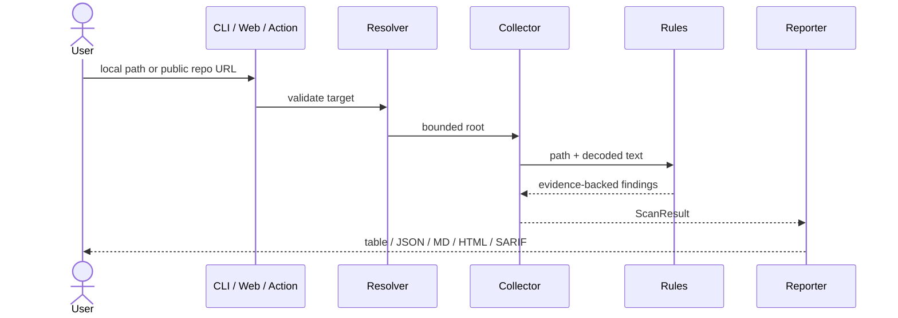

# Architecture

AgentProof is intentionally split into small trust domains so that adding a UI or report format does not widen scanner permissions.

## Components

1. **Target resolver** (`scanner.py`) distinguishes local paths from strict public GitHub repository URLs.
2. **Remote boundary** (`github.py`) accepts only `https://github.com/owner/repository`, queries public metadata, limits archive sizes and rejects traversal paths and symbolic links.
3. **Collector** traverses text files with configurable size and file-count limits. Binary and undecodable files are skipped.
4. **Rule engine** (`rules.py`) applies deterministic text, JSON-structure and repository-level checks.
5. **Finding model** (`models.py`) preserves stable rule IDs, severity, file, line, evidence, remediation and references.
6. **Reporters** (`reporters.py`) transform the same result into terminal, JSON, Markdown, HTML or SARIF without accessing the scanned filesystem.
7. **Delivery adapters** expose the core through a dependency-free CLI, a composite GitHub Action and an optional Streamlit app.

## Data flow

## Scoring

Security starts at 100 and subtracts deterministic severity weights: critical 30, high 14, medium 6 and low 2. Repository quality begins at 100 and deducts 25 for each missing baseline control. The overall score is 80% security and 20% engineering quality.

Scores are prioritization aids, not probability estimates. Findings and evidence are the primary output.

## Extension points

- Add stable metadata to `RULES` and a deterministic matcher in `rules.py`.
- Add tests containing both a malicious fixture and a close safe example.
- Add a reporter that consumes only `ScanResult`.
- Never make a rule execute, import, install or render code from the target.
